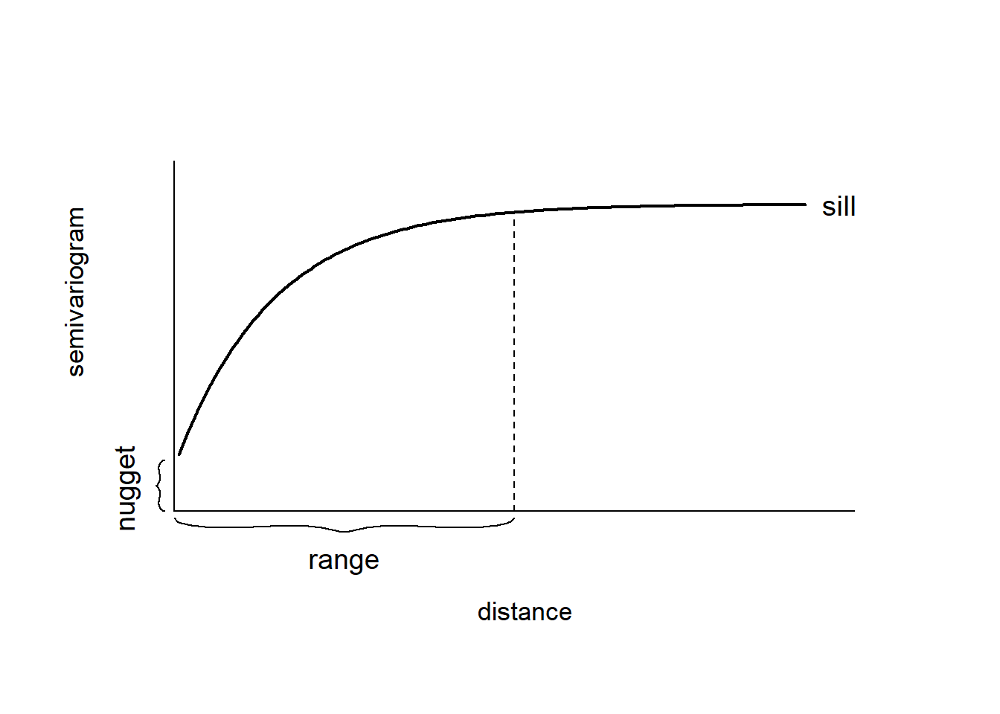

# Geostatistical data

**Learning objectives:**

- Understand the concepts of geostatistical data and Gaussian random fields (GRF)
- Be able to define the GRF correlation structure and simulate GRFs
- Explore the correlation structure of a given GRF by plotting the semivariogram

## The part about geostatistical data {-}

- Geostatistical data: observations $Z(s_1), ..., Z(s_n)$ of a spatially continuous variable $Z$ collected at specific locations $s_1, ..., s_n$.
- Geostatistical data ~ a partial realization of a random process $Z(\cdot)$
- Examples:
  - air pollution
  - temperature levels taken at a set of monitoring stations
- The aims are often to:
  - infer the characteristics of the spatial process (mean, variability, ...)
  - use this information to predict the process at unsampled locations


## The part about geostatistical data {-}

- This chapter: Gaussian random fields
- Chapters 13-15: approaches for spatial interpolation:
  - simple spatial interpolation methods
    - e.g. inverse distance weighted method
  - kriging
  - model-based geostatistics
- Chapter 16: evaluate the predictive performance (ch 16)

## Gaussian random fields: what {-}

- set of random variables $Z(s_i)$ where observations occur in a continuous domain
- every finite collection of random variables has a multivariate normal distribution

## Gaussian random fields: properties {-}

GRFs can be:

- **strictly stationary**: if $Z(\cdot)$ is invariant to shifts: constant distribution
- **weakly stationary** (2nd order stationarity):
  - process has constant mean $E[Z(s)]$
  - _covariances_ depend only on differences between locations: $C(h) = Cov(Z(s), Z(s + h))$
    - if 'differences between locations' only involve distance, not direction, then the process is **isotropic** (opposite: anisotropic).
- **intrinsically stationary**:
  - weakly stationary
  - the _variogram_ $Var[Z(s_i) - Z(s_j)]$ follows from the distance $s_i - s_j$.

## Covariance functions of GRFs {-}

- They describe the spatial correlation structure of the GRF.
- The covariance function type and parameters are needed to simulate a GRF.

## Covariance functions of GRFs {-}

- For a stationary, isotropic GRF we have that $Corr(h) = \frac{C(h)}{\sigma^2}$
- In practice, the **correlation function** $Corr(h)$ is defined (positive definite function) and the covariance function is derived as $C(h) = Corr(h) \cdot \sigma^2$

## Covariance functions of GRFs {-}

- Matérn family of correlation functions is often used:

$$Corr(h) = \frac{1}{2^{\nu-1} \Gamma(\nu)} \cdot \left(\frac{h}{\phi}\right)^\nu \cdot K_\nu\left(\frac{h}{\phi}\right)$$

- Some special cases for smoothing parameter $\nu$:
  - $\nu = 0.5 \implies Corr(h) = e^{-h/\phi}$
  - $\nu \to \infty \implies Corr(h) = e^{-(h/\phi)^2}$

## Covariance functions of GRFs {-}

```{r echo=FALSE, message=FALSE, out.width='100%'}
library(geoR)

covmodel <- "matern"
sigma2 <- 1

# Plot covariance function
curve(cov.spatial(x, cov.pars = c(sigma2, 1),
                  cov.model = covmodel), lty = 1,
      from = 0, to = 1, ylim = c(0, 1), main = "Matérn",
      xlab = "distance", ylab = "Covariance(distance)")
curve(cov.spatial(x, cov.pars = c(sigma2, 0.2),
                  cov.model = covmodel), lty = 2, add = TRUE)
curve(cov.spatial(x, cov.pars = c(sigma2, 0.01),
                  cov.model = covmodel), lty = 3, add = TRUE)
legend(cex = 1.5, "topright", lty = c(1, 1, 2, 3),
       col = c("white", "black", "black", "black"),
       lwd = 2, bty = "n", inset = .01,
       c(expression(paste(sigma^2, " = 1 ")),
         expression(paste(phi, " = 1")),
         expression(paste(phi, " = 0.2")),
         expression(paste(phi, " = 0.01"))))
```

## Covariance functions of GRFs {-}

Calculate values of the covariance function with `geoR::cov.spatial()`:

```{r}
sigma2 <- 1
phi <- 0.2
tibble::tibble(
  distance = seq(0, 1, 0.2),
  covariance_1 = cov.spatial(
    distance, 
    cov.pars = c(sigma2, phi),
    cov.model = "matern",
    kappa = 0.5 # default
  ),
  covariance_2 = cov.spatial(
    distance, 
    cov.pars = c(sigma2, phi),
    cov.model = "matern",
    kappa = 10
  )
)
```

## Simulating GRFs {-}

A GRF can be simulated using `geoR::grf()`.

Some arguments:

- `n`: the number of points in the simulation.
- `grid`: either `"reg"` (simulate in a regular grid) or `"irreg"` (simulate in coordinates).
- `xlims`, `ylims`: limits of the area in the x and y directions. Default `c(0, 1)`.
- `cov.model`: type of correlation function (e.g. `"matern"`)
- `cov.pars`: covariance parameters $\sigma^2$ and $\phi$
- `kappa` = smoothness parameter $\nu$ required by some correlation functions such as `"matern"`. Default is 0.5.


## Simulating GRFs {-}

```{r include=FALSE}
set.seed(20240518)
```

Example:

```{r}
sigma2 <- 1
phi <- 0.2
sim2 <- grf(
  n = 1024, 
  grid = "reg", 
  cov.model = "matern", 
  cov.pars = c(sigma2, phi)
)
```

## Simulating GRFs {-}

```{r}
sim2$data |> str()
```

## Simulating GRFs {-}

```{r echo=FALSE, out.width='100%'}
image(sim2, cex.main = 2,
      col = gray(seq(1, 0.1, l = 30)), xlab = "", ylab = "")
```

## Simulating GRFs {-}

```{r echo=FALSE, message=FALSE, results="hide", out.width='100%'}
sim1 <- grf(1024, grid = "reg",
            cov.model = covmodel, cov.pars = c(sigma2, 1))
sim3 <- grf(1024, grid = "reg",
            cov.model = covmodel, cov.pars = c(sigma2, 0.01))
par(mfrow = c(1, 3), mar = c(2, 2, 2, 0.2))
image(sim1, main = expression(paste(phi, " = 1")), cex.main = 2,
      col = gray(seq(1, 0.1, l = 30)), xlab = "", ylab = "")
image(sim2, main = expression(paste(phi, " = 0.2")), cex.main = 2,
      col = gray(seq(1, 0.1, l = 30)), xlab = "", ylab = "")
image(sim3, main = expression(paste(phi, " = 0.01")), cex.main=2,
      col = gray(seq(1, 0.1, l = 30)), xlab = "", ylab = "")
```

## Summarizing the GRF's correlation structure {-}

- In an intrinsically stationary GRF, the variance of $Z(s_i) - Z(s_j)$ is a function of the distance $h = s_i - s_j$ (see before).
- By definition:
  - variogram = $2 \cdot \gamma(h) = Var[Z(s + h) - Z(s)] = E[(Z(s + h) - Z(s))^2]$
  - semivariogram = $\gamma(h) = \frac{1}{2} \cdot Var[Z(s + h) - Z(s)] = \frac{1}{2} \cdot E[(Z(s + h) - Z(s))^2]$

## Summarizing the GRF's correlation structure {-}

- In an intrinsically stationary GRF, the variance of $Z(s_i) - Z(s_j)$ is a function of the distance $h = s_i - s_j$ (see before).
- By definition:
  - variogram = $2 \cdot \gamma(h) = Var[Z(s + h) - Z(s)] = E[(Z(s + h) - Z(s))^2]$
  - semivariogram = $\gamma(h) = \frac{1}{2} \cdot Var[Z(s + h) - Z(s)] = \frac{1}{2} \cdot E[(Z(s + h) - Z(s))^2]$
- Estimated by the **empirical variogram**, a tool to evaluate the presence of spatial correlation in data:

$$2 \cdot \hat{\gamma}(h) = \frac{1}{|N(h)|} \cdot \displaystyle\sum_{N(h)}(Z(s_i) - Z(s_j))^2$$

## Summarizing the GRF's correlation structure {-}

Plotting the semivariogram:



## Summarizing the GRF's correlation structure {-}

The semivariogram can be computed with `geoR::variog()`.

Some arguments:

- `option`:
  - `"bin"` (default) returns values of binned semivariogram
  - `"cloud"`  returns the semivariogram cloud
    - i.e. points $(h_{ij},v_{ij})$ with: \
    $h_{ij}=||s_i−s_j||$ \
    $v_{ij} = \frac{1}{2} \cdot (Z(s_i) - Z(s_j))^2$
  - `"smooth"` returns the kernel smoothed semivariogram
- `uvec`: to define the variogram binning (`option = "bin"`).
  - if a scalar is provided, this is the default number of bins
  - if not provided: 13 bins are calculated
- `max.dist`: maximum distance for the semivariogram
- `trend`: specifies the mean part of the model. 
By default, `trend = "cte"` so the mean is assumed constant over the region.

A trend can be fitted using ordinary least squares: then variograms are computed using the residuals.

## Summarizing the GRF's correlation structure {-}

Example dataset from {geoR} for which we'll compute semivariograms:

```{r}
str(parana, max.level = 1, give.attr = FALSE)
```

## Summarizing the GRF's correlation structure {-}

```{r results='hide'}
variog_cloud <- variog(
  coords = parana$coords, 
  data = parana$data,
  option = "cloud", 
  max.dist = 400
)
```

```{r}
str(variog_cloud[c("u", "v")])
```

## Summarizing the GRF's correlation structure {-}

```{r results='hide'}
variog_bin <- variog(
  coords = parana$coords, 
  data = parana$data, 
  max.dist = 400
)
```

```{r}
str(variog_bin[c("u", "v")])
```


## Summarizing the GRF's correlation structure {-}


```{r out.width='100%'}
par(mfrow = c(1, 2), mar = c(2, 2, 2, 2))
plot(variog_cloud)
plot(variog_bin)
```


## Meeting Videos {-}

### Cohort 1 {-}

`r knitr::include_url("https://www.youtube.com/embed/URL")`

<details>
<summary> Meeting chat log </summary>

```
LOG
```
</details>
